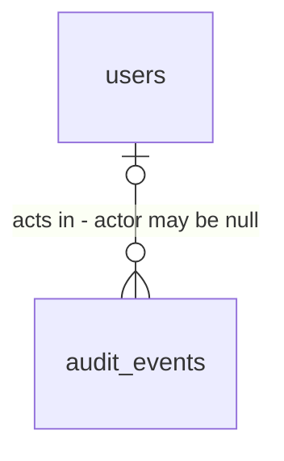

# Audit

Sources:

- conversation (2026-10-08) - próximo passo do `STATE.md` Handoff: API e tela de leitura do log de auditoria
- `.specs/STATE.md` AD-007 - `audit_events` é append-only, escrito na mesma transação da mutação por `platform/audit`; "the `audit` feature only reads"
- `.specs/features/users/plan.md` door 8 (forma de `audit.Record` e da tabela) e `.specs/features/rbac/plan.md` door 3 (ações `role.*` e `user.roles_changed`)
- `.specs/LESSONS.md` L-010 (confirmada) - componente web que ramifica entra na Test policy com todos os ramos provados

## Problem

Toda mutação do sistema grava um evento em `audit_events`: quem fez, o quê, sobre qual recurso, o antes e o
depois, o IP e o `request_id`. Hoje ninguém consegue ler esses eventos sem abrir o `psql` direto no banco de
produção. O admin que precisa responder "quem desativou este usuário?" ou "quem deu o papel admin a fulano?"
não tem como fazer isso pelo sistema. A trilha existe e, na prática, não serve para nada.

A fonte não traz números: o template ainda não tem usuários reais.

Quando isto entra, quem tem `audit:read` abre `/audit`, vê os eventos do mais recente para o mais antigo, filtra
por ação, por quem agiu, por recurso e por período, e abre um evento para ver o antes e o depois.

## Out of scope

| Excluded | Why |
| --- | --- |
| Escrever, editar ou apagar eventos | AD-007: o feature `audit` só lê; o trigger append-only já recusa `UPDATE`/`DELETE` |
| Retenção, expurgo ou arquivamento | o trigger proíbe `DELETE`; expurgo exige decisão de política fora do template |
| Exportar (CSV, JSON) | nenhuma fonte pediu; a API já entrega JSON |
| Busca por texto livre dentro de `before`/`after` | consulta em `jsonb` sem índice sobre tabela que só cresce; os filtros estruturados cobrem as perguntas da fonte |
| Links "Ver auditoria" nas telas de usuário e de papel | tocam outras features; a tela aceita os filtros pela URL, então o link entra depois sem mudar este contrato |
| Auditar a própria leitura da auditoria | AD-007 registra mutações; leitura não é mutação |

## Assumptions

| Assumption | Chosen default | Rationale | Confirmed? |
| --- | --- | --- | --- |
| Paginação | cursor: `limit` (default 50, máx 100) e `before` (o `id` do último evento da página anterior); resposta `{items, next}` com `next` nulo na última página; sem `total` | a tabela só cresce (todo login grava); `offset` e `count(*)` ficam lentos com o volume e páginas escorregam quando chegam eventos novos | y |
| Ordem | `id` decrescente (o mais recente primeiro) | `id` é identity e cresce na ordem de inserção; `occurred_at` é o início da transação e pode empatar ou inverter | y |
| Filtros | `action` (exato), `actor_id`, `resource_type` + `resource_id` (este só junto com o tipo), `from` e `to` (RFC 3339, sobre `occurred_at`, `from` inclusivo e `to` exclusivo); todos combináveis | respondem "quem fez", "o que aconteceu com este recurso" e "o que houve neste período" | y |
| Item da lista | `id`, `occurred_at`, `action`, `actor` (`{id, email}` ou nulo), `resource_type`, `resource_id`, `ip`, `request_id`; sem `before`/`after` | a lista é para varrer; o JSON completo pesa e fica no detalhe | y |
| Ator nulo | exibido como `Sistema` | eventos da CLI (`create-admin`) não têm sessão | y |
| Catálogo de ações | `GET /api/v1/audit/actions` devolve as `AuditAction` declaradas em `op`, ordenadas | mesma fonte única que o catálogo de permissões do `rbac`; o select da tela não fica desatualizado | y |
| Permissão | `audit:read` em todas as operações | convenção `<feature>:<action>`; o `admin` já tem pelo `*` | y |
| Tela de lista | `/audit` com colunas `Quando`, `Ação`, `Quem`, `Recurso`; filtros `Ação` (select), `De` e `Até` (datas, dia inteiro no fuso do navegador); clicar em `Quem` ou em `Recurso` filtra por ele; filtros ficam na URL | filtros na URL deixam o link "Ver auditoria" entrar depois sem mudar nada aqui | y |
| Tela de detalhe | `/audit/$id` com os campos do item mais `before` e `after` em JSON formatado, lado a lado | o antes e o depois são o motivo de abrir o evento | y |
| Data exibida | `dd/mm/aaaa hh:mm:ss` no fuso do navegador | UI em pt-BR (foundation) | y |

**Open questions:** none - all resolved or logged above.

## Criteria

### S1: Listar eventos (P1)

**Acceptance Criteria**

1. WHEN `GET /api/v1/audit/events` is called by a user holding `audit:read` THEN the system SHALL return `200` with `items` ordered by `id` descending, each with `id`, `occurred_at`, `action`, `actor`, `resource_type`, `resource_id`, `ip` and `request_id`, and no `before` or `after`
2. WHEN an event has an actor THEN its `actor` SHALL be `{id, email}` with the actor's current email; WHEN the event has no actor THEN `actor` SHALL be `null`
3. WHEN more events match than `limit` THEN the system SHALL return `limit` items and `next` equal to the `id` of the last item; WHEN no more events match THEN `next` SHALL be `null`; `limit` defaults to `50`
4. WHEN `before` is sent THEN the system SHALL return only events whose `id` is below `before`
5. IF `limit` is below 1 or above 100, `before` is below 1, `from` or `to` is not an RFC 3339 timestamp, `actor_id` is not a UUID, or `resource_id` is sent without `resource_type` THEN the system SHALL return `422` with an `errors` entry naming the parameter

**Independent test:** como admin, criar um usuário e desativá-lo; `GET /audit/events?limit=1` traz `user.deactivated` com `next`; repetir com `before=<next>` traz `user.created`.

### S2: Filtrar eventos (P1)

**Acceptance Criteria**

6. WHEN `action` is sent THEN the system SHALL return only events with that exact action
7. WHEN `actor_id` is sent THEN the system SHALL return only events whose actor is that user
8. WHEN `resource_type` is sent THEN the system SHALL return only events of that type, and WHEN `resource_id` is also sent THEN only events of that type and id
9. WHEN `from` or `to` is sent THEN the system SHALL return only events with `occurred_at >= from` and `occurred_at < to`
10. WHEN several filters are sent THEN the system SHALL return only events matching all of them, and `next` SHALL page within the filtered set
11. WHEN `GET /api/v1/audit/actions` is called by a user holding `audit:read` THEN the system SHALL return `200` with `items`, the sorted distinct `AuditAction` of every operation registered in `op`

**Independent test:** `GET /audit/events?action=user.created&resource_type=user&resource_id=<id>` traz exatamente um evento.

### S3: Ver um evento (P1)

**Acceptance Criteria**

12. WHEN `GET /api/v1/audit/events/{id}` names an existing event THEN the system SHALL return `200` with the list fields plus `before` and `after` as stored, `null` when absent
13. IF `{id}` names no event THEN the system SHALL return `404`; IF `{id}` is not a positive integer THEN `422`

**Independent test:** abrir o evento `user.updated` de uma troca de nome e ver o nome antigo em `before` e o novo em `after`.

### S4: Acesso (P1)

**Acceptance Criteria**

14. The system SHALL declare `audit:read` on the three audit operations
15. IF a signed-in user without `audit:read` calls an audit operation THEN the system SHALL return `403`; without a session `401`
16. The system SHALL NOT expose any route under `/api/v1/audit` with method `POST`, `PUT`, `PATCH` or `DELETE`

**Independent test:** usuário com papel sem `audit:read` recebe `403` em `GET /audit/events`.

### S5: Web - lista de eventos (P2)

**Acceptance Criteria**

17. WHEN `/audit` loads for a user holding `audit:read` THEN the web app SHALL show a table with the columns `Quando`, `Ação`, `Quem` and `Recurso`; `Quando` as `dd/mm/aaaa hh:mm:ss` in the browser time zone, `Quem` as the actor email or `Sistema`, `Recurso` as `<resource_type> <resource_id>`
18. IF the API returns no items THEN `/audit` SHALL show `Nenhum evento encontrado.`
19. WHILE the events request is pending `/audit` SHALL show an element with `role="status"`
20. IF the events request fails with a status other than `401` and `403` THEN `/audit` SHALL show `Não foi possível carregar a auditoria.` and a button `Tentar novamente`
21. IF the signed-in user lacks `audit:read`, or the API answers `403` THEN `/audit` and `/audit/$id` SHALL show `Você não tem permissão para acessar esta página.` and the menu SHALL hide the link `Auditoria`
22. WHEN `next` is not null THEN `/audit` SHALL show a button `Mais antigos` that appends the next page below the current rows; WHEN `next` is null the button SHALL not be shown
23. WHEN an action is chosen in the `Ação` select, whose options are `Todas` plus every item of `GET /api/v1/audit/actions` THEN the web app SHALL put `action` in the URL and reload the list filtered
24. WHEN `De` and `Até` are filled with dates THEN the web app SHALL send `from` as the start of `De` and `to` as the start of the day after `Até`, both in the browser time zone
25. WHEN the email in `Quem`, or the text in `Recurso`, is clicked THEN the web app SHALL add `actor_id`, or `resource_type` and `resource_id`, to the URL and reload the list filtered, showing the active filter with a button `Limpar filtros`
26. WHEN `/audit` is opened with filter parameters in the URL THEN the web app SHALL send them to the API on the first request
27. WHEN a row's `Quando` is clicked THEN the web app SHALL navigate to `/audit/<id>`

**Independent test:** como admin, `/audit` lista eventos; escolher `user.created` filtra; clicar no e-mail filtra pelo ator; `Mais antigos` acrescenta a página seguinte.

### S6: Web - detalhe do evento (P2)

**Acceptance Criteria**

28. WHEN `/audit/$id` loads THEN the web app SHALL show `Ação`, `Quando`, `Quem`, `Recurso`, `IP` and `Request ID`, and two blocks `Antes` and `Depois` with the JSON indented by 2 spaces, or `—` when null
29. IF the event request returns `404` THEN `/audit/$id` SHALL show `Evento não encontrado.`
30. WHILE the event request is pending `/audit/$id` SHALL show an element with `role="status"`, and IF it fails with another status THEN it SHALL show `Não foi possível carregar a auditoria.` and `Tentar novamente`

**Independent test:** abrir um `user.roles_changed` e ver `{"roles": [...]}` antes e depois.

## Traceability

| ID | Slice | Criteria | Status |
| --- | --- | --- | --- |
| AUD-01 | S1 | 1, 2, 3, 4, 5 | Implementing |
| AUD-02 | S2 | 6, 7, 8, 9, 10, 11 | Implementing |
| AUD-03 | S3 | 12, 13 | Implementing |
| AUD-04 | S4 | 14, 15, 16 | Implementing |
| AUD-05 | S5 | 17, 18, 19, 20, 21, 22, 23, 24, 25, 26, 27 | Implementing |
| AUD-06 | S6 | 28, 29, 30 | Implementing |

## Observable

| Surface | Decision | Landing |
| --- | --- | --- |
| API `GET /api/v1/audit/events` | response shape | AC 1, AC 2, AC 3 |
| API `GET /api/v1/audit/events` | error shape and codes | AC 5, AC 15; forma do erro é a foundation door 3 |
| API `GET /api/v1/audit/events/{id}` | response shape | AC 12 |
| API `GET /api/v1/audit/events/{id}` | error shape and codes | AC 13, AC 15 |
| API `GET /api/v1/audit/actions` | response shape | AC 11 |
| API `/api/v1/audit/*` | who may call it | AC 14, AC 15 |
| API `/api/v1/audit/*` | versioning | existing - prefixo `/api/v1` (foundation door 2) |
| API `/api/v1/audit/*` | rate limit behaviour | n/a - só leitura com sessão e permissão; `limit` máximo 100 limita o custo de cada chamada |
| screen `/audit` | empty state | AC 18 |
| screen `/audit` | loading state | AC 19 |
| screen `/audit` | error state | AC 20 |
| screen `/audit` | unauthorised state | AC 21 |
| screen `/audit` | density and ordering | AC 1, AC 3, AC 22 - mais recente primeiro, 50 por vez |
| screen `/audit` | destructive action confirms | n/a - a tela não muda nada |
| screen `/audit/$id` | loading, error, not found | AC 29, AC 30 |
| screen `/audit/$id` | unauthorised state | AC 21 |
| screen `/audit/$id` | empty state | AC 28 - `before`/`after` nulos aparecem como `—` |
| document `AGENTS.md` | what the reader does next | n/a - nenhum comando ou regra nova |

## Flow

Reaproveita `platform/auth` (checagem de `audit:read`), `op` (metadado `audit_action` de cada operação, que já
é exigido no boot, vira o catálogo de ações) e a tabela `audit_events` que `platform/audit` (exists) escreve. O
feature `audit` não importa `platform/audit`: só lê a tabela por SQL do próprio slice.

1. request -> `platform/httpx` (exists) -> `platform/auth` (exists) - `401` sem sessão, `403` sem `audit:read`
2. `features/audit/list_events` (new, foundation door 6) - valida os parâmetros, monta a consulta por `id` decrescente com os filtros e `LEFT JOIN users` para o e-mail do ator, pede `limit + 1` linhas para saber se há `next`
3. `features/audit/get_event` (new) - um evento por `id`, com `before`/`after`
4. `features/audit/list_actions` (new) - lê `op` (door 3); não toca o banco
5. out: JSON do slice ou problem+json

Web:

6. `/audit` e `/audit/$id` -> `web/src/features/audit/` (new) chamam só `src/api/client.ts` (exists); filtros validados por `validateSearch` (Zod, `z.coerce.string()`, porque o router lê `resource_id=42` da URL como número) na rota, com as datas de `De`/`Até` guardadas na URL como `de`/`ate` (`aaaa-mm-dd`) e convertidas em `from`/`to` só na chamada à API; o menu (`features/users/UserMenu`) ganha o link `Auditoria`

## Relations

Nenhuma entidade nova. One-way constraints: `audit_events` continua só aceitando `INSERT` (users door 8); a
ordem de leitura é pelo `id` (door 1). No columns and no types here.

## Surface

| Route | In | Out | Status |
| --- | --- | --- | --- |
| `GET /api/v1/audit/events` | `limit`?, `before`?, `action`?, `actor_id`?, `resource_type`?, `resource_id`?, `from`?, `to`? | `items[]` de `id` · `occurred_at` · `action` · `actor` · `resource_type` · `resource_id` · `ip` · `request_id`; `next` | `200`, `401`, `403`, `422` |
| `GET /api/v1/audit/events/{id}` | `id` | os campos do item mais `before` · `after` | `200`, `401`, `403`, `404`, `422` |
| `GET /api/v1/audit/actions` | nada | `items[]` | `200`, `401`, `403` |

Toda operação também documenta `500` (problem+json de falha interna, foundation door 3); o contrato exato de cada
rota é a lista acima mais `500` (mesma regra do `rbac`).

## Landing

| One-way door | Literal shape | Alternative rejected |
| --- | --- | --- |
| 1. paginação por cursor | `limit` (1-100, default 50) e `before` (int64 >= 1); itens por `id DESC`; resposta `{"items": [...], "next": <id do último item> \| null}`; o `id` do evento é exposto como número inteiro | `limit`/`offset` com `total` como em `users` - `count(*)` e `OFFSET` degradam numa tabela que só cresce, e um evento novo empurra a página seguinte, repetindo linhas; cursor por `occurred_at` - não é único nem monotônico (é o início da transação) |
| 2. índices de leitura | migration nova: `CREATE INDEX audit_events_actor_idx ON audit_events (actor_id, id DESC)`, `audit_events_resource_idx ON audit_events (resource_type, resource_id, id DESC)`, `audit_events_action_idx ON audit_events (action, id DESC)`, `audit_events_occurred_idx ON audit_events (occurred_at)` | sem índices - cada filtro vira varredura da tabela inteira; índice `GIN` em `before`/`after` - não há busca dentro do JSON (Out of scope) |
| 3. catálogo de ações | `GET /api/v1/audit/actions` devolve as `op.MetaAuditAction` não vazias das operações registradas, sem repetição, ordenadas; função `op.AuditActions(api) []string` ao lado de `op.Permissions` | `SELECT DISTINCT action FROM audit_events` - varre a tabela e esconde ações que ainda não aconteceram; lista fixa na web - desatualiza a cada feature nova |
| 4. rotas e permissão | prefixo `/api/v1/audit/` (foundation door 2): `/events`, `/events/{id}`, `/actions`; permissão `audit:read` | `/api/v1/audit-events` - foge do prefixo por feature |

- Nothing else in this change is hard to reverse

## Impact

| Front | What changes |
| --- | --- |
| domain | new term: `catálogo de ações` - as `AuditAction` declaradas em `op`; fonte única para o filtro da tela |
| platform | `op` ganha `AuditActions(api)`, irmã de `Permissions(api)`; nada muda no registro |
| stored data | migration com 4 índices sobre `audit_events`; a tabela é append-only e criar índice não a altera; em produção com volume grande, `CREATE INDEX` trava escritas durante a criação (o template não tem produção) |
| web | o Vitest roda com `TZ=America/Sao_Paulo` (`vite.config.ts`), para que datas no fuso do navegador tenham valor exato nos testes |
| web | o menu (`UserMenu`) ganha o link `Auditoria` para quem tem `audit:read`; novas rotas `/audit` e `/audit/$id` |
| contract | `AuditActor` declara o próprio schema (objeto `nullable`), porque o Huma recusa a tag `nullable` em campo de struct; o cliente gerado tipa `actor` como `{id, email} \| null` |
| contract | os tipos de corpo de `audit` têm nomes próprios (`AuditEvent`, `AuditEventDetail`, `AuditEventPage`, `AuditActionList`, `AuditActor`) para não colidir no schema do Huma |
