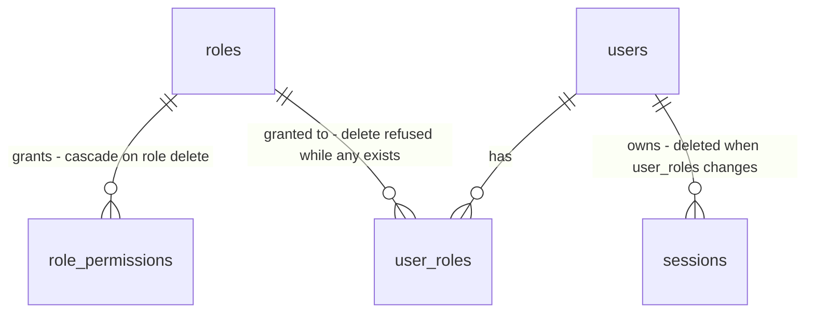

# RBAC

Sources:

- conversation (2026-10-08) - próximo passo do `STATE.md` Handoff: endpoints e telas de papéis; a troca de papéis de um usuário apaga as sessões dele na mesma transação
- `.specs/STATE.md` AD-005, AD-006, AD-007 - papéis e atribuições no banco, permissões como constantes Go, `admin` semeado com `*`, auditoria na mesma transação
- `.claude/skills/auth-security/SKILL.md` regra 6 - mudar os papéis de um usuário apaga as sessões dele na mesma transação
- `.specs/features/users/plan.md` - doors 1, 5, 6, 7, 8, 16 e 17 (UUID, `op.Spec`, `Principal`, papel `admin` e `*`, `audit.Record`, layout `_authed`, `op.Spec.Errors`)

## Problem

As tabelas `roles`, `role_permissions` e `user_roles` existem e `platform/auth` checa a permissão de cada operação,
mas o único papel é o `admin` semeado e o único jeito de dar um papel a alguém é a CLI `create-admin`. Todo
usuário criado por `POST /api/v1/users` nasce sem papel e recebe `403` em toda operação com `Permission`. O
sistema tem dois tipos de pessoa: quem pode tudo e quem não pode nada. Para dar acesso parcial, alguém precisa
abrir o `psql` e escrever em `user_roles` sem auditoria e sem derrubar sessões.

A fonte não traz números: o template ainda não tem usuários reais.

Quando isto entra, um admin cria papéis com um subconjunto das permissões que o código registra, atribui
papéis a usuários pela tela do usuário, e cada mudança fica auditada. A sessão do usuário cujos papéis
mudaram cai na mesma transação.

## Out of scope

| Excluded | Why |
| --- | --- |
| Papéis por tenant, hierarquia ou herança entre papéis | AD-006: RBAC global, papel é uma lista plana de permissões |
| Criar permissões pela API | AD-006: permissões são constantes Go; o catálogo é o que `op` registra |
| Conceder `*` a outro papel | só o `admin` semeado carrega o curinga (users door 7); um segundo curinga só nasce por migration |
| Proteger o último admin em `deactivate` de `users` | comportamento da feature `users` (só recusa a si mesmo); a recuperação é `api users create-admin` |
| Mostrar os papéis na listagem `/users` | a listagem é da feature `users`; aqui os papéis aparecem na tela do usuário |
| Leitura da auditoria | feature `audit` |

## Assumptions

| Assumption | Chosen default | Rationale | Confirmed? |
| --- | --- | --- | --- |
| Forma da atribuição | `PUT /api/v1/rbac/users/{id}/roles` com o conjunto completo de `role_ids`; substitui o conjunto atual | um evento de auditoria e uma derrubada de sessão por alteração; a tela é uma lista de checkboxes com `Salvar` | y |
| Quais mudanças derrubam sessões | só a mudança dos papéis de um usuário (regra 6); editar as permissões de um papel não apaga sessões | `auth.Lookup` relê as permissões do banco a cada requisição, então a edição já vale na requisição seguinte; apagar as sessões de todos os portadores derrubaria gente sem motivo | y |
| Mudar os próprios papéis | permitido; as sessões do próprio chamador também caem e o web volta para `/login` (users AC 50) | a regra 6 é literal; abrir exceção para o chamador é o caso que um atacante com sessão roubada usaria | y |
| `PUT` com o mesmo conjunto atual | `204`, nada muda, nenhuma sessão apagada, nenhum evento de auditoria | mesma regra do `activate`/`deactivate` de `users` (users AC 40): auditoria registra mudanças | y |
| Papel `admin` | não pode ser renomeado, ter as permissões alteradas nem ser excluído: `409` | é o único dono de `*`; editá-lo tranca todos fora | y |
| Último admin | `PUT` que deixaria nenhum usuário ativo com o papel `admin` responde `409` e nada muda | sem isso o admin remove o próprio papel e só a CLI recupera | y |
| Excluir papel em uso | `409` enquanto algum usuário tiver o papel; o admin remove as atribuições antes | excluir em cascata mudaria os papéis de vários usuários sem passar pela regra 6 nem auditar cada um | y |
| Nome do papel | `trim`, 1-50 caracteres, único sem diferenciar caixa | `Editor` e `editor` lado a lado confundem quem atribui | y |
| Permissões aceitas | cada uma precisa existir em `op.Permissions(api)` (o catálogo); `*` e desconhecidas respondem `422`; lista vazia é válida | permissão fora do catálogo não protege nada e mascara erro de digitação | y |
| Edição concorrente do mesmo papel | última escrita vence | painel administrativo pequeno; versão otimista seria complexidade sem caso real | y |
| Listagem de papéis | sem paginação, ordenada por nome, com `permissions` e `user_count` | poucos papéis por sistema; `user_count` explica o `409` da exclusão antes do clique | y |
| Permissões das operações | `rbac:read`, `rbac:create`, `rbac:update`, `rbac:delete`, `rbac:assign` | convenção `<feature>:<action>` do AGENTS.md | y |
| Telas | `/roles`, `/roles/new`, `/roles/$id`; seção `Papéis` em `/users/$id`; link `Papéis` no menu para quem tem `rbac:read` | espelha a API; a atribuição fica onde o admin já está olhando o usuário | y |
| Permissão exibida | o identificador cru (`users:read`), agrupado pelo prefixo da feature | não há rótulos no código; inventar tradução seria uma segunda fonte que diverge | y |

**Open questions:** none - all resolved or logged above.

## Criteria

### S1: Catálogo e leitura de papéis (P1)

**Acceptance Criteria**

1. WHEN `GET /api/v1/rbac/permissions` is called by a user holding `rbac:read` THEN the system SHALL return `200` with `items`, the sorted list of every `Permission` registered in `op`, excluding `*`
2. WHEN `GET /api/v1/rbac/roles` is called by a user holding `rbac:read` THEN the system SHALL return `200` with `items` ordered by name ascending, each with `id`, `name`, `permissions` (sorted) and `user_count`
3. WHEN `GET /api/v1/rbac/roles/{id}` names an existing role THEN the system SHALL return `200` with `id`, `name`, `permissions` and `user_count`
4. IF `{id}` names no role on `GET`, `PATCH` or `DELETE` of `/api/v1/rbac/roles/{id}` THEN the system SHALL return `404`; IF `{id}` is not a UUID THEN `422`

**Independent test:** admin logado; `GET /rbac/permissions` lista `rbac:*` e `users:*`; `GET /rbac/roles` traz `admin` com `permissions: ["*"]` e `user_count: 1`.

### S2: Criar, editar e excluir papéis (P1)

**Acceptance Criteria**

5. WHEN `POST /api/v1/rbac/roles` receives a `name` of 1-50 characters after trim and `permissions` that all belong to the catalogue THEN the system SHALL return `201` with `id`, `name`, `permissions` and `user_count: 0`, and record one audit event `role.created`
6. IF the role name, compared without case after trim, already belongs to a role THEN `POST` and `PATCH` of `/api/v1/rbac/roles` SHALL return `409` and change nothing
7. WHEN two `POST /api/v1/rbac/roles` with the same name run concurrently THEN exactly one SHALL return `201` and the other `409`
8. IF `name` is empty or over 50 characters after trim, or `permissions` holds `*`, a value outside the catalogue or a duplicate THEN `POST` and `PATCH` SHALL return `422` with an `errors` entry whose `location` names the offending field
9. WHEN `PATCH /api/v1/rbac/roles/{id}` receives `name`, `permissions` or both, valid THEN the system SHALL update only the fields sent, replacing the whole permission set when `permissions` is sent, return `200` with the role, and record one audit event `role.updated` with `before` and `after`
10. WHEN the permissions of a role change THEN the next request of every holder SHALL be authorised against the new set, and no session SHALL be deleted
11. IF `PATCH` or `DELETE` targets the role `admin` THEN the system SHALL return `409` and change nothing
12. WHEN `DELETE /api/v1/rbac/roles/{id}` targets a role no user holds THEN the system SHALL delete the role and its permissions, return `204` and record one audit event `role.deleted`
13. IF `DELETE /api/v1/rbac/roles/{id}` targets a role at least one user holds THEN the system SHALL return `409` and change nothing

**Independent test:** criar `Leitor` com `users:read`; renomear; tentar excluir `admin` e ver `409`; excluir `Leitor` e ver `204`.

### S3: Atribuir papéis a um usuário (P1)

**Acceptance Criteria**

14. WHEN `GET /api/v1/rbac/users/{id}/roles` names an existing user THEN the system SHALL return `200` with `items`, the roles of that user ordered by name, each with `id` and `name`
15. WHEN `PUT /api/v1/rbac/users/{id}/roles` receives `role_ids` that differ from the user's current set THEN the system SHALL replace the set, delete every session of that user, record one audit event `user.roles_changed` with the sorted role names in `before` and `after`, all in one transaction, and return `204`
16. WHEN `PUT /api/v1/rbac/users/{id}/roles` receives the user's current set THEN the system SHALL return `204`, change nothing, delete no session and record no audit event
17. IF `role_ids` holds an id that names no role, or a duplicate THEN `PUT` SHALL return `422` with an `errors` entry at `body.role_ids` and change nothing
18. IF `{id}` names no user on `GET` or `PUT` of `/api/v1/rbac/users/{id}/roles` THEN the system SHALL return `404`; IF it is not a UUID THEN `422`
19. IF `PUT` would leave no active user holding the role `admin` THEN the system SHALL return `409` and change nothing
20. WHEN two `PUT` remove the role `admin` from the only two active admins concurrently THEN exactly one SHALL return `204` and the other `409`
21. IF the transaction of `PUT` rolls back THEN the role set, the sessions and `audit_events` SHALL be unchanged

**Independent test:** como admin, atribuir `Leitor` a `b@x.com` logado num segundo cookie jar; o cookie de `b` recebe `401` em `/me`; `b` entra de novo e recebe `200` em `GET /users` e `403` em `POST /users`; remover o `admin` do único admin responde `409`.

### S4: Acesso às operações de RBAC (P1)

**Acceptance Criteria**

22. The system SHALL declare `rbac:read` on the three `GET` operations, `rbac:create` on `POST /roles`, `rbac:update` on `PATCH /roles/{id}`, `rbac:delete` on `DELETE /roles/{id}` and `rbac:assign` on `PUT /users/{id}/roles`
23. IF a signed-in user without the declared permission calls an RBAC operation THEN the system SHALL return `403` and SHALL NOT run the handler

**Independent test:** usuário com papel `Leitor` (`users:read`) recebe `403` em `GET /rbac/roles`.

### S5: Web - telas de papéis (P2)

**Acceptance Criteria**

24. WHEN `/roles` loads for a user holding `rbac:read` THEN the web app SHALL show a table with the columns `Nome`, `Permissões` (the count, or `Todas` for `*`) and `Usuários`
25. WHILE `GET /api/v1/rbac/roles` is pending `/roles` SHALL show an element with `role="status"`
26. IF `GET /api/v1/rbac/roles` fails with a status other than `401` and `403` THEN `/roles` SHALL show `Não foi possível carregar os papéis.` and a button `Tentar novamente`
27. IF the signed-in user lacks `rbac:read`, or the API answers `403` THEN `/roles`, `/roles/new` and `/roles/$id` SHALL show `Você não tem permissão para acessar esta página.` and the menu SHALL hide the link `Papéis`
28. WHEN `/roles/new` is submitted with a name and the checked permissions THEN the web app SHALL create the role and navigate to `/roles/<new id>`
29. The role form SHALL list every catalogue permission as a checkbox, grouped under a heading with the text before `:`
30. IF creation or edition of a role returns `409` THEN the form SHALL show `Já existe um papel com este nome.` under the name field
31. IF creation or edition of a role returns `422` THEN the form SHALL show each `errors` message under the field its `location` names
32. WHEN `/roles/$id` is saved THEN the web app SHALL send `PATCH` with only the changed fields and show `Alterações salvas.`
33. WHILE `/roles/$id` shows the role `admin` the web app SHALL show `O papel admin tem todas as permissões e não pode ser alterado.`, disable every field and hide `Salvar` and `Excluir`
34. WHEN `Excluir` is clicked on `/roles/$id` THEN the web app SHALL open a dialog reading `Excluir o papel <nome>?` with `Cancelar` and `Excluir`, and SHALL call the API only on `Excluir`, then navigate to `/roles`
35. WHILE the role on `/roles/$id` has `user_count` above `0` the web app SHALL disable `Excluir` and show `Remova este papel dos <n> usuários antes de excluí-lo.`
36. IF `GET /api/v1/rbac/roles/{id}` returns `404` THEN `/roles/$id` SHALL show `Papel não encontrado.`

**Independent test:** como admin, `/roles` lista `admin`; `/roles/new` cria `Leitor`; `/roles/$id` renomeia e exclui com confirmação; `admin` aparece bloqueado.

### S6: Web - papéis na tela do usuário (P2)

**Acceptance Criteria**

37. WHILE `/users/$id` is shown to a user holding `rbac:read` the web app SHALL show a section `Papéis` with one checkbox per role, checked for the roles the user holds
38. WHILE the signed-in user lacks `rbac:assign` the section `Papéis` SHALL show the checkboxes disabled and no `Salvar papéis` button
39. WHEN `Salvar papéis` is clicked with a changed selection THEN the web app SHALL open a dialog reading `Alterar os papéis de <email>? As sessões deste usuário serão encerradas.` and SHALL call `PUT` only on `Confirmar`, then show `Papéis atualizados.`
40. IF `PUT` returns `409` THEN the section SHALL show `Não é possível remover o último administrador.`
41. WHILE the signed-in user lacks `rbac:read` the web app SHALL not render the section `Papéis` nor call any `/api/v1/rbac` route

**Independent test:** como admin, abrir `/users/$id` de `b`, marcar `Leitor`, confirmar e ver `Papéis atualizados.`; desmarcar `admin` em si mesmo, sendo o único, e ver a mensagem do último administrador.

## Traceability

| ID | Slice | Criteria | Status |
| --- | --- | --- | --- |
| RBAC-01 | S1 | 1, 2, 3, 4 | Verified |
| RBAC-02 | S2 | 5, 6, 7, 8, 9, 10, 11, 12, 13 | Verified |
| RBAC-03 | S3 | 14, 15, 16, 17, 18, 19, 20, 21 | Verified |
| RBAC-04 | S4 | 22, 23 | Verified |
| RBAC-05 | S5 | 24, 25, 26, 27, 28, 29, 30, 31, 32, 33, 34, 35, 36 | Verified |
| RBAC-06 | S6 | 37, 38, 39, 40, 41 | Verified |

## Observable

| Surface | Decision | Landing |
| --- | --- | --- |
| API `GET /api/v1/rbac/permissions` | response shape | AC 1 |
| API `/api/v1/rbac/roles` (CRUD) | response shape | AC 2, AC 3, AC 5, AC 9, AC 12 |
| API `/api/v1/rbac/roles` (CRUD) | error shape and codes | AC 4, AC 6, AC 8, AC 11, AC 13; forma do erro é a foundation door 3 |
| API `/api/v1/rbac/users/{id}/roles` | response shape | AC 14, AC 15, AC 16 |
| API `/api/v1/rbac/users/{id}/roles` | error shape and codes | AC 17, AC 18, AC 19 |
| API `/api/v1/rbac/*` | who may call it | AC 22, AC 23 |
| API `/api/v1/rbac/*` | versioning | existing - prefixo `/api/v1` (foundation door 2) |
| API `/api/v1/rbac/*` | rate limit behaviour | n/a - toda operação exige sessão com permissão; só o login é alvo de força bruta |
| screen `/roles` | empty state | n/a - o papel `admin` semeado não pode ser excluído (AC 11), a lista nunca fica vazia |
| screen `/roles` | loading state | AC 25 |
| screen `/roles` | error state | AC 26 |
| screen `/roles` | unauthorised state | AC 27 |
| screen `/roles` | density and ordering | AC 2, AC 24 - por nome, sem paginação |
| screen `/roles/new` | error state | AC 30, AC 31 |
| screen `/roles/new` | empty state | AC 29 - o catálogo nunca é vazio: as próprias operações `rbac:*` estão nele |
| screen `/roles/$id` | loading, error, not found | AC 25 e AC 26 aplicados à tela de detalhe; AC 36 |
| screen `/roles/$id` | destructive action confirms | AC 34, AC 35 |
| screen `/roles/$id` | papel imutável | AC 33 |
| screen `/users/$id` seção `Papéis` | destructive action confirms | AC 39 - derruba sessões, por isso confirma |
| screen `/users/$id` seção `Papéis` | unauthorised state | AC 38, AC 41 |
| screen `/users/$id` seção `Papéis` | error state | AC 40; os demais erros usam `Não foi possível carregar os papéis.` de AC 26 |
| screen `/users/$id` seção `Papéis` | empty state | n/a - sempre existe ao menos o papel `admin` para listar |
| document `AGENTS.md` | what the reader does next | n/a - nenhum comando ou regra nova; `rbac` segue as convenções existentes |

## Flow

Reaproveita `platform/auth` (checagem de `Permission` e releitura das permissões por requisição),
`platform/op.Permissions(api)` (o catálogo, já usado pelo `me` para expandir `*`), `platform/db.WithTx`,
`platform/audit.Record` e o layout `_authed` do web. Nenhum slice de `rbac` importa `users`: as tabelas
`users` e `sessions` são lidas e escritas por SQL do próprio slice.

1. request -> `platform/httpx` (exists) -> `platform/auth` (exists) - `401` sem sessão, `403` sem a permissão `rbac:*` declarada
2. `features/rbac/<slice>` (new, foundation door 6) - valida o corpo; as permissões contra `op.Permissions(api)` lido na requisição, porque no registro o catálogo ainda está incompleto
3. `features/rbac/assign_roles` (new) - abre `db.WithTx`, trava o papel `admin` (door 2), compara o conjunto, troca `user_roles`, apaga `sessions` do usuário e chama `platform/audit` (exists) com o mesmo `tx`
4. `platform/db` (exists) - commit ou rollback de mudança, sessões e evento juntos
5. out: JSON do slice ou problem+json; na requisição seguinte `platform/auth` (exists) relê as permissões do banco

Web:

6. `/roles*` e a seção `Papéis` -> `web/src/features/rbac/` (new) chamam só `src/api/client.ts` (exists); a rota `/users/$id` compõe `UserDetail` (users) e `UserRoles` (rbac) (door 4); `UserRoles` lê o e-mail do usuário por `GET /api/v1/users/{id}` (mesma chave de cache `["user", id]` do `UserDetail`) para o texto da confirmação; `useMe`/`can` saem de `features/users` para `src/lib/session.ts` (door 5)

## Relations

One-way constraints: nome do papel único sem diferenciar caixa (door 1); o papel `admin` é imutável e sempre tem
ao menos um portador ativo (door 2); `role_permissions` só guarda valores do catálogo, e `*` só no `admin`. Nenhuma
tabela nova. No columns and no types here.

## Surface

| Route | In | Out | Status |
| --- | --- | --- | --- |
| `GET /api/v1/rbac/permissions` | nada | `items[]` | `200`, `401`, `403` |
| `GET /api/v1/rbac/roles` | nada | `items[]` de `id` · `name` · `permissions` · `user_count` | `200`, `401`, `403` |
| `POST /api/v1/rbac/roles` | `name`, `permissions` | papel | `201`, `401`, `403`, `409`, `422` |
| `GET /api/v1/rbac/roles/{id}` | `id` | papel | `200`, `401`, `403`, `404`, `422` |
| `PATCH /api/v1/rbac/roles/{id}` | `id`, `name`?, `permissions`? | papel | `200`, `401`, `403`, `404`, `409`, `422` |
| `DELETE /api/v1/rbac/roles/{id}` | `id` | nada | `204`, `401`, `403`, `404`, `409`, `422` |
| `GET /api/v1/rbac/users/{id}/roles` | `id` | `items[]` de `id` · `name` | `200`, `401`, `403`, `404`, `422` |
| `PUT /api/v1/rbac/users/{id}/roles` | `id`, `role_ids` | nada | `204`, `401`, `403`, `404`, `409`, `422` |

Toda operação também documenta `500` (problem+json de falha interna, foundation door 3); o contrato exato de cada rota é a lista acima mais `500` (decisão do usuário, 2026-10-08, verificação rodada 1).

## Landing

| One-way door | Literal shape | Alternative rejected |
| --- | --- | --- |
| 1. unicidade do nome do papel | migration nova: `CREATE UNIQUE INDEX roles_name_lower_key ON roles (lower(name))`; o app grava `trim(name)` e preserva a caixa digitada | `CHECK (name = lower(name))` como em `users.email` - o nome do papel é rótulo exibido, forçar minúsculas estraga `Financeiro`; só o `UNIQUE (name)` atual - `Editor` e `editor` convivem |
| 2. guarda do último admin | dentro do `tx` do `PUT`: `SELECT id FROM roles WHERE name = 'admin' FOR UPDATE` antes de contar os portadores ativos do `admin` excluindo o usuário alvo | contar sem trava - dois `PUT` concorrentes veem um ao outro como o admin restante e ambos removem (AC 20); trigger no banco - a regra depende de `users.deactivated_at` e esconde o `409` atrás de uma exceção genérica |
| 3. rotas e permissões | prefixo `/api/v1/rbac/` (foundation door 2); papéis em `/rbac/roles`, atribuição em `/rbac/users/{id}/roles`; permissões `rbac:read`, `rbac:create`, `rbac:update`, `rbac:delete`, `rbac:assign`; ações de auditoria `role.created`, `role.updated`, `role.deleted`, `user.roles_changed` | `/api/v1/users/{id}/roles` - a rota seria da feature `users` e o slice de `rbac` ficaria fora do próprio prefixo; `POST`/`DELETE` por papel - N eventos e N derrubadas de sessão para uma única edição na tela |
| 4. composição entre features no web | só arquivos em `web/src/routes/` importam mais de uma feature; `routes/_authed/users/$id.tsx` renderiza `UserDetail` e `UserRoles`; `features/users` só ganha o `Link` para `/roles` no menu | `UserDetail` importando `features/rbac` - repete no web o acoplamento que o archtest proíbe no backend (AGENTS.md regras 2 e 6) |
| 5. sessão compartilhada no web | `web/src/features/users/session.ts` (`Me`, `ApiError`, `meQuery`, `useMe`, `can`) e `problems.ts` (`fieldErrors`, `forbidden`) movidos para `web/src/lib/`; `features/users` passa a importar de lá | `features/rbac` importar de `features/users` - acoplamento entre features; copiar - duas definições de `can` (AGENTS.md regra 3: o segundo consumidor move para o compartilhado) |

- Nothing else in this change is hard to reverse

## Impact

| Front | What changes |
| --- | --- |
| domain | new term: `catálogo de permissões` - o conjunto de `Permission` registradas em `op`, sem `*`; fonte única para validar e exibir |
| domain | existing term: papel `admin` era só um seed, agora é imutável pela API e tem guarda de último portador - quem depende hoje: `features/users/bootstrap` (atribui `admin` por nome, inalterado) |
| stored data | migration com o índice `lower(name)`: o banco só tem `admin`, não há par que colida |
| web | `session.ts` e `problems.ts` mudam para `src/lib/`, e `Field.tsx` para `src/components/` (o formulário de papéis também o usa); `emailInUse`, que só `users` usa, fica em `features/users/copy.ts`; os imports de `features/users/*` mudam de caminho, sem mudar asserção |
| web | o menu (`UserMenu`) ganha o link `Papéis`; `routes/_authed/users/$id.tsx` passa a compor duas features |
| contract | os tipos de corpo de `rbac` têm nomes próprios (`Role`, `RoleList`, `NewRole`, `RoleChanges`, `PermissionList`, `UserRoleList`, `RoleAssignment`) para não colidir no schema do Huma (users Impact `contract`) |
| auth | nenhuma mudança em `platform/auth`: a releitura por requisição já faz AC 10 valer |
| gate | `archtest` ganha `CheckWebFeatureImports` (door 4): nenhum arquivo em `web/src/features/<a>/` importa `@/features/<b>/` |
| tests | `features/rbac/rbactest` registra operações de sonda (`zeta:do`, uma `Authenticated`) e `Declare(...)` para pôr permissões no catálogo sem importar outra feature |
