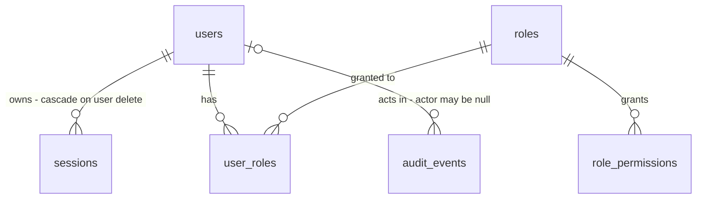

# Users

Sources:

- conversation (2026-10-08) - escopo: `users` traz autenticação, a base de RBAC (tabelas, papel `admin`, checagem de permissão) e `platform/audit`; o primeiro admin nasce por subcomando de CLI
- `.specs/STATE.md` AD-005, AD-006, AD-007 - restrições de autenticação, RBAC e auditoria que este plano segue
- `.claude/skills/auth-security/SKILL.md` - as 8 regras de segurança que fecham o que AD-005 deixa aberto; cada uma vira door ou critério aqui
- `.specs/features/foundation/plan.md` - doors 2, 3, 5, 6, 11 e 12 (prefixo de rota, forma de erro, `op.Spec`, layout de slice, raiz de composição)

## Problem

O template sobe, mas qualquer requisição chega a qualquer operação: não existe identidade, sessão, nem quem
seja barrado. `op.Spec.Permission` é declarada e ninguém a lê; `AuditAction` é exigida no boot e nenhum evento é
gravado. A primeira feature de negócio construída sobre isto ou fica aberta, ou cada uma inventa o próprio login,
o próprio formato de cookie e a própria checagem - e o próximo agente copia a primeira que aparecer.

Não há evidência numérica na fonte: é um template sem usuários reais ainda.

Quando isto entra, um admin criado pela CLI entra pela tela de login, gerencia usuários, e toda operação do
sistema passa a exigir sessão válida e a permissão que declarou, gravando auditoria na mesma transação da
mudança. Desativar um usuário derruba suas sessões na requisição seguinte.

## Out of scope

| Excluded | Why |
| --- | --- |
| Gerenciar papéis e atribuir papéis a usuários (API e telas) | feature `rbac`; aqui só as tabelas, o papel `admin` semeado e a checagem. Usuários criados pela API nascem sem papel |
| Leitura da auditoria (API e telas) | feature `audit` (AD-007: "the `audit` feature only reads"); aqui só a escrita |
| Admin redefinir a senha de outro usuário, "esqueci minha senha", e-mail | exige canal de entrega fora do template; recuperação de admin é `api users create-admin` com outro e-mail |
| Excluir usuário | desativar cobre o caso e preserva a autoria nos eventos de auditoria |
| MFA, OIDC, JWT | AD-005 |
| Expiração deslizante de sessão | TTL absoluto basta para o template; deslizar exige escrita por requisição |
| Lockout permanente de conta | permite que terceiros bloqueiem qualquer conta; rate limit por janela cobre a força bruta |

## Assumptions

| Assumption | Chosen default | Rationale | Confirmed? |
| --- | --- | --- | --- |
| Quanto de RBAC/auditoria entra aqui | autenticação, tabelas `roles`/`role_permissions`/`user_roles`, papel `admin` semeado, checagem de `Spec.Permission` (403) e `platform/audit`; `rbac` depois só adiciona os endpoints de papéis | toda operação protegida desde o primeiro dia | y |
| Como nasce o primeiro admin | subcomando `api users create-admin --email --name`, senha lida do stdin | explícito como `api migrate up`; senha nunca em env, migration ou imagem | y |
| Duração da sessão | absoluta, `SESSION_TTL` com default `12h`; sem renovação | uma jornada de trabalho; revogação real é por exclusão da linha (AD-005) | n |
| Rate limit de login | falhas contadas numa janela de 15 min: 5 por e-mail, 20 por IP; a 6ª (ou 21ª) responde `429` com `Retry-After` sem verificar senha; sucesso apaga as falhas do e-mail | regra 7 do auth-security; contagem por e-mail submetido vale também para e-mails inexistentes, então não enumera | n |
| Política de senha | 12 a 128 caracteres, sem regra de composição | NIST 800-63B; o teto limita o custo do argon2 por requisição | n |
| E-mail | comparado e armazenado em minúsculas após `trim`; login não diferencia caixa | `Ana@x.com` e `ana@x.com` são a mesma pessoa | n |
| Listagem | ordenada por e-mail ascendente; `limit` (default 50, máx 100) e `offset`; resposta `{items, total}` | painel administrativo pequeno; cursor seria complexidade sem volume | n |
| Desativar a si mesmo | recusado com `409` | evita que o único admin se tranque fora; o caso de dois admins se desativando mutuamente é recuperado pela CLI | n |
| Desativar quem já está desativado (e ativar quem já está ativo) | `204`, nada muda, nenhum evento de auditoria | retry seguro; auditoria registra mudanças, não tentativas | n |
| Senha atual errada na troca de senha | `422` com erro em `body.current_password` | `401` faria o front tratar como sessão perdida e deslogar | n |
| Login falho | não gera evento de auditoria; gera log `WARN` com `request_id` e IP, sem o e-mail | auditoria registra mutações confirmadas (AD-007); o e-mail tentado é dado pessoal de quem talvez nem seja usuário | n |
| Login e logout | auditados como `session.created` e `session.deleted`, ator = o usuário da sessão | são mutações (AD-007, regra 4 do AGENTS.md) | n |
| Hash com parâmetros antigos | no login bem-sucedido, re-hash com os parâmetros fixados na mesma transação | é o que torna "subir os parâmetros depois" (regra 4) efetivo sem forçar troca de senha | n |
| CSRF | `SameSite=Lax` + toda mutação exige corpo JSON ou método não-simples; sem token CSRF | Lax bloqueia POST cross-site; o Huma rejeita `Content-Type` não-JSON; mesmo origin (foundation door 9) | n |
| `COOKIE_SECURE` | default `true`; `task dev` define `false` | a falha segura é o default; só o dev local roda em http | n |
| Telas | `/login`, `/users`, `/users/new`, `/users/$id`, `/account/password`; menu com e-mail do usuário e `Sair` | espelha a API (AGENTS.md regra 6); textos em pt-BR | n |

**Open questions:** none - all resolved or logged above.

## Criteria

### S1: Primeiro admin pela CLI (P1)

**Acceptance Criteria**

1. WHEN `api users create-admin --email <e> --name <n>` runs with a 12-128 character password on stdin and `<e>` belongs to no user THEN the system SHALL create an active user with email `lower(trim(<e>))`, assign it the role `admin`, record one audit event `user.created` with a null actor, and exit `0`
2. IF the email given to `create-admin` already belongs to a user THEN the command SHALL exit `1`, write a line containing `already exists` to stderr, and create no row
3. IF `--email` or `--name` is missing, or the password read from stdin has fewer than 12 or more than 128 characters THEN the command SHALL exit `2`, write a usage line to stderr, and create no row
4. The system SHALL store every password only as an argon2id PHC string `$argon2id$v=19$m=65536,t=3,p=4$<salt>$<key>` with a 16-byte random salt and a 32-byte key
5. WHEN a login succeeds against a hash whose parameters differ from `m=65536,t=3,p=4` THEN the system SHALL replace the stored hash with one using those parameters in the same transaction

**Independent test:** `api migrate up`, `echo 'senha-longa-123' | api users create-admin --email a@x.com --name Ana`, `SELECT password_hash FROM users` começa com `$argon2id$v=19$m=65536,t=3,p=4$`; rodar de novo e ver exit `1`.

### S2: Sessão - login, logout, quem sou eu (P1)

**Acceptance Criteria**

6. WHEN `POST /api/v1/users/session` receives the email and password of an active user THEN the system SHALL return `204` with `Set-Cookie: session=<43-char base64url token>; Path=/; Max-Age=<SESSION_TTL in seconds>; HttpOnly; SameSite=Lax`, plus `Secure` when `COOKIE_SECURE=true`
7. The system SHALL generate each session token from 32 bytes of `crypto/rand` and persist only its SHA-256; no column SHALL hold the raw token
8. WHEN a login succeeds on a request that already carries a `session` cookie THEN the system SHALL return a token different from the one sent and delete the session the sent cookie referred to
9. IF the email is unknown, the password is wrong, or the user is deactivated THEN login SHALL return `401` with `detail` `invalid email or password` in all three cases
10. IF the email is unknown THEN login SHALL run one argon2id verification against a fixed dummy hash before answering
11. IF the login body has an `email` that is not an email address, or a `password` that is empty or longer than 128 characters THEN login SHALL return `422`
12. IF 5 failed logins for the same email happened in the last 15 minutes THEN the next login for that email SHALL return `429` with a `Retry-After` header in seconds and SHALL NOT verify the password
13. IF 20 failed logins from the same client IP happened in the last 15 minutes THEN the next login from that IP SHALL return `429` with a `Retry-After` header in seconds
14. WHEN a login succeeds THEN the system SHALL delete the failed-login records of that email
15. WHEN `DELETE /api/v1/users/session` is called with a valid session THEN the system SHALL delete that session, return `204` and send `Set-Cookie: session=; Path=/; Max-Age=0`
16. WHEN `GET /api/v1/users/me` is called with a valid session THEN the system SHALL return `200` with `id`, `email`, `name` and `permissions`, the sorted list of permissions the user holds, with `*` expanded into every permission registered in `op`
17. IF a request to an operation not marked `Public` carries no `session` cookie, an unknown token, a token created more than `SESSION_TTL` ago, or a token of a deactivated user THEN the system SHALL return `401` problem+json and SHALL NOT run the handler

**Independent test:** criar admin pela CLI; `curl -c` no login, `GET /me` com o cookie retorna `200`; logout; o mesmo cookie em `/me` retorna `401`; 6 senhas erradas seguidas retornam `429`.

### S3: Autorização e auditoria em toda operação (P1)

**Acceptance Criteria**

18. IF an operation is registered with none, or more than one, of `Permission`, `Public` and `Authenticated` THEN startup SHALL fail with an error naming the operation ID
19. IF an authenticated user calls an operation whose `Permission` no role of theirs grants, and no role of theirs grants `*` THEN the system SHALL return `403` problem+json and SHALL NOT run the handler
20. WHEN an authenticated user holds a role granting `*` THEN the system SHALL allow every operation that declares a `Permission`
21. WHEN an operation marked `Authenticated` is called with a valid session THEN the system SHALL run the handler regardless of the user's permissions
22. WHEN a mutating operation commits THEN exactly one `audit_events` row SHALL exist for it, committed in the same transaction, carrying actor id, the operation's `AuditAction`, resource type, resource id, `before` and `after` JSON, ip and `request_id`
23. IF the transaction of a mutating operation rolls back THEN no `audit_events` row SHALL exist for it
24. The system SHALL never write the key `password_hash`, nor any password value, into `before` or `after` of an audit event
25. IF an `UPDATE` or `DELETE` is executed against `audit_events` THEN the database SHALL raise an error and change no row
26. WHERE the connection peer address is inside a CIDR listed in `TRUSTED_PROXIES` the system SHALL take the client IP as the rightmost `X-Forwarded-For` address that is not inside `TRUSTED_PROXIES`
27. IF the connection peer address is not inside `TRUSTED_PROXIES` THEN the system SHALL take the client IP from the connection address and ignore `X-Forwarded-For`

**Independent test:** usuário sem papel loga e recebe `403` em `GET /api/v1/users`; admin recebe `200`; criar um usuário e ver uma linha em `audit_events` com o `request_id` do header; `UPDATE audit_events` no psql falha.

### S4: Gestão de usuários pela API (P1)

**Acceptance Criteria**

28. WHEN `POST /api/v1/users` receives a valid `email`, a `name` of 1-100 characters and a 12-128 character `password` THEN the system SHALL return `201` with `id`, `email`, `name`, `active: true` and `created_at`, and no password field
29. IF the email, after `lower(trim())`, already belongs to a user THEN `POST /api/v1/users` SHALL return `409` and create no row
30. WHEN two `POST /api/v1/users` with the same email run concurrently THEN exactly one SHALL return `201` and the other `409`
31. IF `POST /api/v1/users` receives an invalid email, a name empty or over 100 characters, or a password under 12 or over 128 characters THEN it SHALL return `422` with an `errors` entry whose `location` names each offending field
32. WHEN `GET /api/v1/users` is called with `limit` and `offset` THEN the system SHALL return `200` with `items` ordered by email ascending and `total` equal to the number of users; `limit` defaults to `50`
33. IF `GET /api/v1/users` receives `limit` below 1 or above 100, or a negative `offset` THEN it SHALL return `422`
34. WHEN `GET /api/v1/users/{id}` names an existing user THEN the system SHALL return `200` with the same fields as creation plus `deactivated_at`
35. IF `{id}` names no user on `GET`, `PATCH`, `deactivate` or `activate` THEN the system SHALL return `404`; IF `{id}` is not a UUID THEN `422`
36. WHEN `PATCH /api/v1/users/{id}` receives `name`, `email` or both, valid THEN the system SHALL update only the fields sent and return `200` with the updated user
37. IF `PATCH /api/v1/users/{id}` sets an email that belongs to another user THEN it SHALL return `409` and change nothing
38. WHEN `POST /api/v1/users/{id}/deactivate` targets an active user other than the caller THEN the system SHALL set `deactivated_at`, delete every session of that user in the same transaction, and return `204`
39. IF `POST /api/v1/users/{id}/deactivate` targets the caller THEN it SHALL return `409` and change nothing
40. WHEN `deactivate` targets an already deactivated user, or `activate` an already active user THEN the system SHALL return `204`, change nothing and record no audit event
41. WHEN `POST /api/v1/users/{id}/activate` targets a deactivated user THEN the system SHALL clear `deactivated_at` and return `204`

**Independent test:** como admin: criar `b@x.com`, listar, renomear, logar como `b` num segundo cookie jar, desativar `b` e ver o cookie de `b` receber `401` em `/me` logo em seguida.

### S5: Trocar a própria senha (P2)

**Acceptance Criteria**

42. WHEN `PUT /api/v1/users/me/password` receives the correct `current_password` and a 12-128 character `new_password` THEN the system SHALL store the new hash, delete every other session of the caller in the same transaction, keep the current session, and return `204`
43. IF `current_password` is wrong THEN `PUT /api/v1/users/me/password` SHALL return `422` with an `errors` entry at `body.current_password` and change nothing

**Independent test:** logar em dois cookie jars, trocar a senha pelo primeiro, ver o segundo receber `401` e o primeiro continuar `200` em `/me`.

### S6: Web - entrar, sair, rotas protegidas (P1)

**Acceptance Criteria**

44. WHEN a visitor without a valid session opens any web route other than `/login` THEN the web app SHALL navigate to `/login?redirect=<original path>`
45. WHEN the login form is submitted with valid credentials THEN the web app SHALL navigate to the `redirect` path, or to `/` when absent
46. IF login returns `401` THEN the web app SHALL show `E-mail ou senha inválidos.` and keep the typed email
47. IF login returns `429` THEN the web app SHALL show `Muitas tentativas. Tente novamente em <n> minutos.`, with `<n>` the `Retry-After` value rounded up to minutes
48. WHILE the login request is pending the web app SHALL disable the submit button and label it `Entrando…`
49. WHEN the signed-in user clicks `Sair` THEN the web app SHALL call `DELETE /api/v1/users/session` and navigate to `/login`
50. IF any API call returns `401` while the user is signed in THEN the web app SHALL navigate to `/login?redirect=<current path>`

**Independent test:** `task dev`, abrir `/users` sem sessão e cair em `/login?redirect=/users`; entrar e voltar a `/users`; `Sair` volta ao login.

### S7: Web - telas de usuários e da própria senha (P2)

**Acceptance Criteria**

51. WHEN `/users` loads for a user holding `users:read` THEN the web app SHALL show a table with the columns `E-mail`, `Nome` and `Status` (`Ativo` / `Desativado`)
52. IF `GET /api/v1/users` returns no items THEN `/users` SHALL show `Nenhum usuário encontrado.`
53. WHILE `GET /api/v1/users` is pending `/users` SHALL show an element with `role="status"`
54. IF `GET /api/v1/users` fails with a status other than `401` and `403` THEN `/users` SHALL show `Não foi possível carregar os usuários.` and a button `Tentar novamente`
55. IF the signed-in user lacks the permission a screen needs, or the API answers `403` THEN the screen SHALL show `Você não tem permissão para acessar esta página.` and the menu SHALL hide the link to that screen
56. WHEN `/users` has more than `50` users THEN the web app SHALL show `Anterior` and `Próxima` buttons that move by 50, disabled at the first and last page
57. WHEN the `/users/new` form is submitted with valid data THEN the web app SHALL create the user and navigate to `/users/<new id>`
58. IF creation or edition returns `409` THEN the form SHALL show `Este e-mail já está em uso.` under the email field
59. IF creation or edition returns `422` THEN the form SHALL show each `errors` message under the field its `location` names
60. WHEN `/users/$id` is saved with changed name or email THEN the web app SHALL send `PATCH` with only the changed fields and show `Alterações salvas.`
61. WHEN `Desativar` is clicked on `/users/$id` THEN the web app SHALL open a dialog reading `Desativar <email>? As sessões deste usuário serão encerradas.` with `Cancelar` and `Desativar`, and SHALL call the API only on `Desativar`
62. WHILE `/users/$id` shows the signed-in user the web app SHALL hide the `Desativar` button
63. WHEN `Ativar` is clicked on `/users/$id` of a deactivated user THEN the web app SHALL call `activate` and show the status `Ativo`
64. WHEN `/account/password` is submitted with the current password and a new password typed twice identically THEN the web app SHALL call `PUT /api/v1/users/me/password` and show `Senha alterada.`
65. IF the two new-password fields differ THEN `/account/password` SHALL show `As senhas não conferem.` and SHALL NOT call the API

**Independent test:** como admin, `/users` lista; `/users/new` cria; `/users/$id` renomeia, desativa com confirmação, reativa; usuário sem papel vê a mensagem de permissão.

## Traceability

| ID | Slice | Criteria | Status |
| --- | --- | --- | --- |
| USR-01 | S1 | 1, 2, 3, 4, 5 | Verified |
| USR-02 | S2 | 6, 7, 8, 9, 10, 11, 12, 13, 14, 15, 16, 17 | Verified |
| USR-03 | S3 | 18, 19, 20, 21, 22, 23, 24, 25, 26, 27 | Verified |
| USR-04 | S4 | 28, 29, 30, 31, 32, 33, 34, 35, 36, 37, 38, 39, 40, 41 | Verified |
| USR-05 | S5 | 42, 43 | Verified |
| USR-06 | S6 | 44, 45, 46, 47, 48, 49, 50 | Verified |
| USR-07 | S7 | 51, 52, 53, 54, 55, 56, 57, 58, 59, 60, 61, 62, 63, 64, 65 | Verified |

## Observable

| Surface | Decision | Landing |
| --- | --- | --- |
| API `POST /api/v1/users/session` | response shape | AC 6 - corpo vazio, token só no cookie |
| API `POST /api/v1/users/session` | error shape and codes | AC 9, AC 11, AC 12, AC 13 |
| API `POST /api/v1/users/session` | who may call it | AC 18 - `Public` |
| API `POST /api/v1/users/session` | rate limit behaviour | AC 12, AC 13, AC 14 |
| API `DELETE /api/v1/users/session` | response shape | AC 15 |
| API `DELETE /api/v1/users/session` | who may call it | AC 17, AC 21 - `Authenticated` |
| API `GET /api/v1/users/me` | response shape | AC 16 |
| API `GET /api/v1/users/me` | who may call it | AC 17, AC 21 - `Authenticated` |
| API `PUT /api/v1/users/me/password` | response shape and codes | AC 42, AC 43 |
| API `/api/v1/users` (CRUD) | response shape | AC 28, AC 32, AC 34, AC 36 |
| API `/api/v1/users` (CRUD) | error shape and codes | AC 29, AC 31, AC 33, AC 35, AC 37, AC 39; forma do erro é a foundation door 3 |
| API `/api/v1/users` (CRUD) | who may call it | AC 19, AC 20 - `users:read`, `users:create`, `users:update`, `users:deactivate`, `users:activate` |
| API `/api/v1/*` | versioning | existing - prefixo `/api/v1` (foundation door 2) |
| API `/api/v1/users` (CRUD) | rate limit behaviour | n/a - só o login é alvo de força bruta; o resto exige sessão com permissão |
| command `api users create-admin` | flags and defaults | AC 1, AC 3 - `--email` e `--name` obrigatórios, sem default; senha só pelo stdin |
| command `api users create-admin` | exit codes and halfway failure | AC 1, AC 2, AC 3 - tudo numa transação: falha não deixa linha |
| command `api users create-admin` | output format | AC 1 - imprime o id criado no stdout |
| screen `/login` | loading state | AC 48 |
| screen `/login` | error state | AC 46, AC 47 |
| screen `/login` | empty state | n/a - formulário, não há coleção |
| screen `/login` | unauthorised state | n/a - é a tela de quem não está autenticado |
| screen `*` (protegidas) | unauthorised state | AC 44, AC 50 (sem sessão), AC 55 (sem permissão) |
| screen `/users` | empty state | AC 52 |
| screen `/users` | loading state | AC 53 |
| screen `/users` | error state | AC 54 |
| screen `/users` | density and ordering | AC 32, AC 51, AC 56 - por e-mail, 50 por página |
| screen `/users/new` | error state | AC 58, AC 59 |
| screen `/users/$id` | destructive action confirms | AC 61 |
| screen `/users/$id` | loading, error, not found | AC 53, AC 54 aplicados à tela de detalhe; `404` mostra `Usuário não encontrado.` (AC 35) |
| screen `/account/password` | error state | AC 43, AC 59, AC 65 |
| document `AGENTS.md` | what the reader does next | AC 18 - a seção de workflow passa a citar `Authenticated` e `api users create-admin` |

## Flow

Reaproveita a cadeia `platform/httpx`, o registro `platform/op` (que já carrega `Permission`/`Public`/`AuditAction`
nos metadados da operação), `platform/db.WithTx` e o layout de slice gerado por `task new:slice`. Nada aqui
reimplementa Problem Details nem registro de rota.

Requisição autenticada:

1. request -> `platform/httpx` (exists) - request id, log, recover; resolve o IP do cliente (door 9) e guarda no contexto
2. `platform/auth` (new, doors 6 e 18) - middleware Huma instalado por `app.New` antes de qualquer operação: lê a operação; `Public` passa; senão lê o cookie `session`, busca o SHA-256 em `sessions` junto de usuário ativo e permissões; ausente/expirado/desativado -> `401`; sem a `Permission` nem `*` -> `403`; põe o `Principal` no contexto
3. `platform/op` (exists, door 5 muda o contrato) - recusa no boot a operação sem exatamente um de `Permission`/`Public`/`Authenticated`
4. `features/users/<slice>` (new, foundation door 6) - handler; abre `db.WithTx`, muda as linhas e chama `platform/audit` (new, door 8) com o mesmo `tx`
5. `platform/db` (exists) - commit ou rollback de mutação e evento juntos
6. out: JSON do slice ou problem+json (foundation door 3)

Login:

7. `POST /api/v1/users/session` -> `features/users/login` - conta falhas em `login_attempts` (door 10) -> `429`; verifica com `features/users/password` (new, door 11; hash fictício quando o e-mail não existe); cria sessão por `platform/auth` (token, door 4), apaga a sessão antiga do cookie recebido e as falhas do e-mail, grava `session.created`, devolve o cookie

CLI:

8. `api users create-admin` -> `app/cmd/api` (exists) -> `internal/app.CreateAdmin` (exists, raiz de composição; foundation C22 proíbe `cmd/api` de importar features) -> `features/users/bootstrap` (new, door 13) - valida, faz hash, cria usuário + vínculo com `admin` + evento `user.created` numa transação

Web:

9. rota protegida -> layout `_authed` (new, door 16) - `beforeLoad` garante `GET /me` em cache; `401` -> `/login?redirect=`; telas em `web/src/features/users/` chamam só `src/api/client.ts` (exists)

## Relations

`login_attempts` não tem relação: a chave é o e-mail submetido ou o IP, que podem não corresponder a usuário.

One-way constraints: `users.email` único e sempre minúsculo (door 2); `sessions` identificada pelo hash do token
(door 4); `roles.name` único, com `admin` semeado concedendo `*` (door 7); `(role, permission)` e `(user, role)`
únicos; `audit_events` só aceita `INSERT` (door 8); usuários nunca são excluídos, só desativados. No columns and no
types here.

## Surface

| Route | In | Out | Status |
| --- | --- | --- | --- |
| `POST /api/v1/users/session` | `email`, `password`, cookie `session` opcional | `Set-Cookie: session` | `204`, `401`, `422`, `429` |
| `DELETE /api/v1/users/session` | cookie `session` | `Set-Cookie: session=; Max-Age=0` | `204`, `401` |
| `GET /api/v1/users/me` | cookie `session` | `id` · `email` · `name` · `permissions` | `200`, `401` |
| `PUT /api/v1/users/me/password` | `current_password`, `new_password` | nada | `204`, `401`, `422` |
| `POST /api/v1/users` | `email`, `name`, `password` | `id` · `email` · `name` · `active` · `created_at` | `201`, `401`, `403`, `409`, `422` |
| `GET /api/v1/users` | `limit`, `offset` | `items[]` · `total` | `200`, `401`, `403`, `422` |
| `GET /api/v1/users/{id}` | `id` | usuário + `deactivated_at` | `200`, `401`, `403`, `404`, `422` |
| `PATCH /api/v1/users/{id}` | `id`, `name`?, `email`? | usuário | `200`, `401`, `403`, `404`, `409`, `422` |
| `POST /api/v1/users/{id}/deactivate` | `id` | nada | `204`, `401`, `403`, `404`, `409`, `422` |
| `POST /api/v1/users/{id}/activate` | `id` | nada | `204`, `401`, `403`, `404`, `422` |

A CLI `api users create-admin` (exit `0`, `1`, `2`) é contrato de operador, não de API: sua forma literal está na door 13.

## Landing

| One-way door | Literal shape | Alternative rejected |
| --- | --- | --- |
| 1. identificador de usuário | `id uuid PRIMARY KEY DEFAULT gen_random_uuid()` em `users` e `roles`; exposto como string UUID na API | `bigserial` - expõe contagem e ordem de cadastro na URL; UUIDv7 gerado em Go - exige gerar no app e no seed SQL de formas diferentes |
| 2. unicidade de e-mail | coluna `email` com `CHECK (email = lower(email))` e `UNIQUE (email)`; o app grava `lower(trim(email))` | índice único em `lower(email)` guardando o texto original - duas grafias convivem na tela e a busca precisa lembrar do `lower()` em toda query |
| 3. formato do hash de senha | PHC `$argon2id$v=19$m=65536,t=3,p=4$<salt b64>$<key b64>`, salt 16 B, key 32 B, parâmetros fixados em `features/users/password` e lidos de volta do próprio hash | bcrypt - teto de 72 bytes e AD-005 fixa argon2id; parâmetros em coluna separada - duas fontes que podem divergir |
| 4. token de sessão | 32 B de `crypto/rand`, base64url sem padding (43 chars) no cookie `session; Path=/; HttpOnly; SameSite=Lax; Secure=<COOKIE_SECURE>`; `sessions` guarda `token_hash bytea PRIMARY KEY` (SHA-256), `user_id` com `ON DELETE CASCADE`, `created_at`; expirada quando `created_at + SESSION_TTL < now()` | token cru no banco - vazamento do banco vira sessões válidas (regra 1); JWT ou cookie assinado - não revogável (AD-005) |
| 5. contrato de operação (muda foundation door 5 e AC 16) | `op.Spec` ganha `Authenticated bool`; exatamente um de `Permission`, `Public`, `Authenticated`; metadado `op.MetaAuthenticated = "authenticated"` | `Public` + checagem manual no handler - o esquecimento passa em silêncio, que é o que a door 5 existe para impedir |
| 6. identidade no contexto | `platform/auth`: `auth.Middleware(api, pool)` registrado em `httpx.NewAPI`; `auth.PrincipalFrom(ctx) (auth.Principal, bool)`, `Principal{UserID uuid.UUID, SessionHash []byte, Permissions map[op.Permission]struct{}}` | cada feature lendo o cookie - formato e regra de expiração duplicados |
| 7. papel `admin` e curinga | migration semeia `roles(name='admin')` e `role_permissions(role_id, permission='*')`; `*` é a única permissão curinga e só o checador a interpreta | sincronizar no boot a lista de permissões registradas para o `admin` - escrita no banco a cada boot e duas réplicas disputando |
| 8. escrita de auditoria | `platform/audit.Record(ctx, tx pgx.Tx, audit.Event{Action, ResourceType, ResourceID string; Before, After any})`, ator/ip/request_id lidos do contexto; tabela `audit_events` com trigger `BEFORE UPDATE OR DELETE ... RAISE EXCEPTION` | `REVOKE UPDATE, DELETE` - o template conecta com um único usuário dono das tabelas, para quem `REVOKE` não vale; log assíncrono - AD-007 |
| 9. IP do cliente | config `TRUSTED_PROXIES` (lista de CIDR separada por vírgula, default vazio); `httpx.ClientIP(ctx) netip.Addr`: `X-Forwarded-For` lido da direita para a esquerda só quando o par TCP é confiável | sempre confiar em `X-Forwarded-For` - qualquer cliente forja o IP auditado e escapa do rate limit por IP (regra 8) |
| 10. armazenamento do rate limit | tabela `login_attempts(kind text CHECK (kind IN ('email','ip')), key text, at timestamptz)`; conta linhas em 15 min; linhas mais velhas que a janela apagadas a cada falha registrada | contador em memória - cada réplica conta sozinha e reiniciar zera; Redis - dependência nova só para isto |
| 11. pacote compartilhado dentro da feature | `features/users/password` importado pelos slices `login`, `create_user`, `change_password` e por `bootstrap`; archtest já permite import dentro da mesma feature | `platform/password` - só `users` usa (AGENTS.md regra 3); copiar em cada slice - três cópias dos parâmetros |
| 12. dependências novas | Go: `golang.org/x/crypto/argon2` (hoje indireta, vira direta); web: componentes shadcn `input`, `label`, `table`, `dialog` (trazem `@radix-ui/react-dialog`, `@radix-ui/react-label`) | implementar argon2 - nunca; modal próprio - foco e `Esc` acessíveis já resolvidos pelo Radix |
| 13. subcomando de bootstrap | `api users create-admin --email <e> --name <n>`, senha no stdin, exit `0`/`1`/`2`; lógica em `features/users/bootstrap`, `cmd/api` só faz o parse | criar admin no boot via env - senha no ambiente e escrita no `serve` |
| 14. rotas de sessão | `/api/v1/users/session` (POST/DELETE), `/api/v1/users/me`, `/api/v1/users/me/password` | `/api/v1/auth/*` - não existe feature `auth`, e foundation door 2 põe toda rota sob `/api/v1/<feature>/` |
| 15. configuração | `SESSION_TTL` (default `12h`), `COOKIE_SECURE` (default `true`), `TRUSTED_PROXIES` (default vazio) em `platform/config` | constantes no código - impossível rodar em http local sem editar fonte |
| 16. guarda de rota no web | layout de rota `web/src/routes/_authed.tsx` com `beforeLoad` chamando `queryClient.ensureQueryData(meQuery)`; telas protegidas como filhas; hook `useMe()`/`can(permission)` em `web/src/features/users/` | checar sessão dentro de cada tela - a primeira esquecida vaza conteúdo; contexto React próprio - duplica o cache do TanStack Query |
| 17. status de erro documentados (achado no build, 2026-10-08) | `op.Spec.Errors []int` lista os status próprios da operação (`404`, `409`, `429`...); `op.Register` acrescenta `401` a toda operação não `Public` e `403` a toda operação com `Permission`, e repassa a `huma.Operation.Errors` | declarar `401`/`403` em cada slice - a primeira esquecida some do contrato que o web consome; não documentar - o cliente gerado não conhece os status que o `Surface` revisou |
| 18. onde o middleware de auth é instalado (corrige a door 6, achado no build, 2026-10-08) | `auth.Install(api, pool, ttl)` chamado em `app.New` (e em `testkit.NewAPI`) logo após `httpx.NewAPI` e antes do registro de qualquer operação; `httpx.NewAPI` continua sem banco | dentro de `httpx.NewAPI` - ela é usada sem banco (export do OpenAPI, testes da foundation) e não recebe pool; o Huma liga o middleware à operação no registro, então quem instala precisa ser a raiz de composição |

- Nothing else in this change is hard to reverse

## Impact

| Front | What changes |
| --- | --- |
| domain | new term: `Principal` - usuário autenticado da requisição com suas permissões, vive em `platform/auth` |
| domain | new term: `Authenticated` - terceira marca de acesso de `op.Spec`: qualquer sessão válida, sem permissão específica |
| domain | new term: permissão `*` - curinga concedido ao papel `admin`; só `platform/auth` interpreta |
| domain | existing term: `op.Spec` exigia exatamente um de `Permission`/`Public`, agora um de três - quem depende hoje: `platform/health` (registra `/healthz` e `/readyz` como `Public`, inalterado), o template do `cmd/newslice` (gera `Permission`, inalterado) e o teste da foundation para AC 16, que precisa do caso novo |
| domain | existing term: `Permission` era só declarada, agora é exigida - toda operação futura com `Permission` responde `403` a quem não tem papel; o slice gerado por `task new:slice` passa a responder `401` antes do `501` sem sessão, e o teste gerado precisa autenticar (muda o template do gerador e a foundation AC 26) |
| stored data | nothing to migrate - tabelas novas em banco sem usuários; o seed do papel `admin` vai na própria migration |
| config | três variáveis novas com defaults; `task dev:api`, `task serve:bin` e o serviço `app` do `compose.yaml` passam `COOKIE_SECURE=false` (http local) |
| docs | `AGENTS.md` ganha `Authenticated`, `api users create-admin` e o passo de criar o admin no `task dev` |
| web | `/` passa a exigir sessão (AC 44): o helper `stubFetch` dos testes da foundation responde `GET /api/v1/users/me` como admin por padrão, e o e2e `api online` (foundation C49) faz login antes de abrir `/`; as asserções da foundation não mudaram |
| web | `makeRouter` e `makeTestRouter` recebem o `QueryClient` (contexto do router, usado pelo `beforeLoad` do layout `_authed`); `renderAt` devolve também o `router` |
| contract | o Huma nomeia schemas pelo nome do tipo Go: dois slices com `Body` colidem e o boot entra em pânico; os tipos de corpo dos slices de `users` têm nomes próprios (`Credentials`, `NewUser`, `UserChanges`, `PasswordChange`, `UserDetail`, `UserPage`...) |
| platform | `deps.Deps` ganha `Logger`, `SessionTTL`, `CookieSecure`; `run()` de `cmd/api` ganha `stdin`; `testkit` ganha `MigratedDB` (um container por binário de teste, um banco clonado por teste), `NewAPI`, `SignIn` e `Do` |
| gate | `task test` roda com `GOFLAGS=-p=4 -timeout=30m`: o gate aninhado do gerador passa dos 10 min padrão do `go test`. No Windows, `testkit` fixa `DOCKER_HOST` no pipe do Docker Desktop quando ele está vazio, porque sob carga a detecção do testcontainers por ping falhava ("rootless Docker is not supported"). `testkit.MigratedDB` tenta subir o container até 6 vezes. O Vitest roda com `testTimeout: 30_000` |
